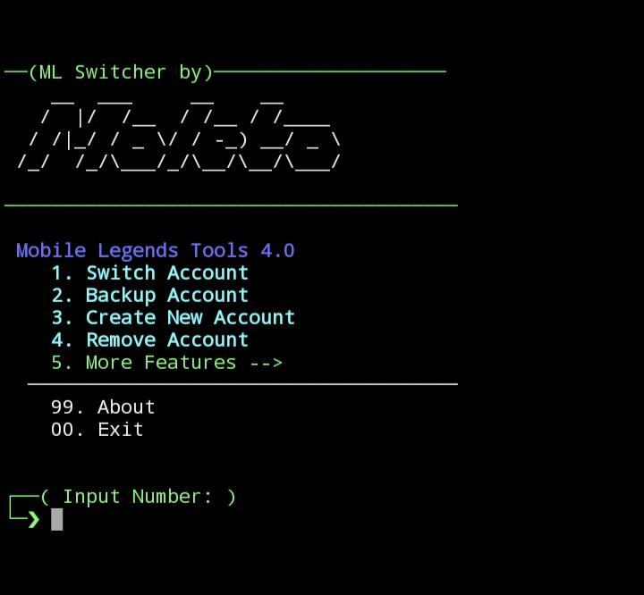

# Mobile Legends Tools
> You need root to run this script
---
## Features
- Backup Account ML to External
- Create New Account
- Reset Guess Account
- Unlock FPS Ultra
- Clean Log & Cache ML

## Screenshot 
<div align="center">
  
</div>

## Usage
Run this script at the terminal
``` shell
su -c ./MoLeTo.sh
```

## DISCLAIMER
*WARNING:* MoLeTo is a tool developed for educational and personal use purposes. By using MoLeTo, you understand and agree that:

- MoLeTo is not an official product of Shanghai Moonton and has no affiliation with the company.
- We do not have permission to use the name, logo, or other intellectual properties of Mobile Legends.
- Use of MoLeTo is not endorsed or guaranteed by Shanghai Moonton, and may violate the terms of service set by the company.
